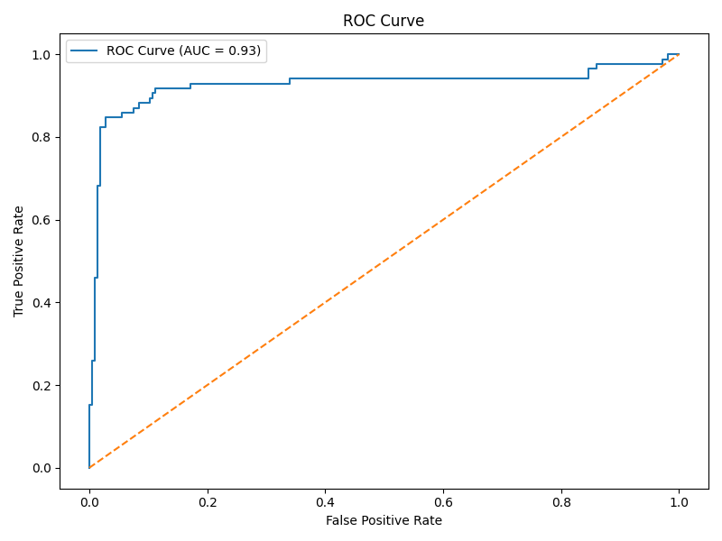

# Job Seeker Success Prediction

Predicting the success probability of job seekers using historical hiring data.
This project was developed for a case study of Gorai Technology Solutions (GTS).

---

## Problem Statement

GTS aims to predict the likelihood of a job candidate being hired, based on their skills, experience, interview scores, and other features.  

---

## Dataset Overview

- **Records:** 1500 candidates
- **Features:** 10 predictors + 1 target (`HiringDecision`)
- **Source:** [Dataset from Kaggle](https://www.kaggle.com/datasets/rabieelkharoua/predicting-hiring-decisions-in-recruitment-data)

| Feature | Description |
|:---|:---|
| Age | Candidate's age |
| Gender | 0: Male, 1: Female |
| EducationLevel |  Highest level of education attained by the candidate: 1–4 (Bachelor's, Master's, PhD) |
| ExperienceYears | Years of professional experience |
| PreviousCompanies | Number of companies worked before |
| DistanceFromCompany | Distance from residence to company (km) |
| InterviewScore | Interview performance score |
| SkillScore | Technical skills score |
| PersonalityScore | Personality evaluation score |
| RecruitmentStrategy | 1: Aggressive, 2: Moderate, 3: Conservative |

---

## Methodology

- **Data Preprocessing**
  - Handling missing values
  - Scaling numerical features
  - One-Hot Encoding for categorical features

- **Modeling**
  - Logistic Regression
  - Random Forest
  - XGBoost

- **Model Selection**
  - Selected based on ROC AUC score
  - Hyperparameter tuning with GridSearchCV

- **Evaluation Metrics**
  - Accuracy
  - F1-Score
  - ROC Curve

---

## Results

- **Best Model:** Random Forest
- **Final ROC AUC Score:** 0.93

  
**Top Features:**
- Aggressive Recruitment Strategy
- Personality Score
- Skill Score
- Interview Score
- Years of Experience

---

## Streamlit Web App

Built an easy-to-use Streamlit app for recruiters to:

- Input candidate details
- Predict hiring success probability instantly

[Deployed](https://job-seeker-success-prediction.streamlit.app/) on Streamlit Cloud 
